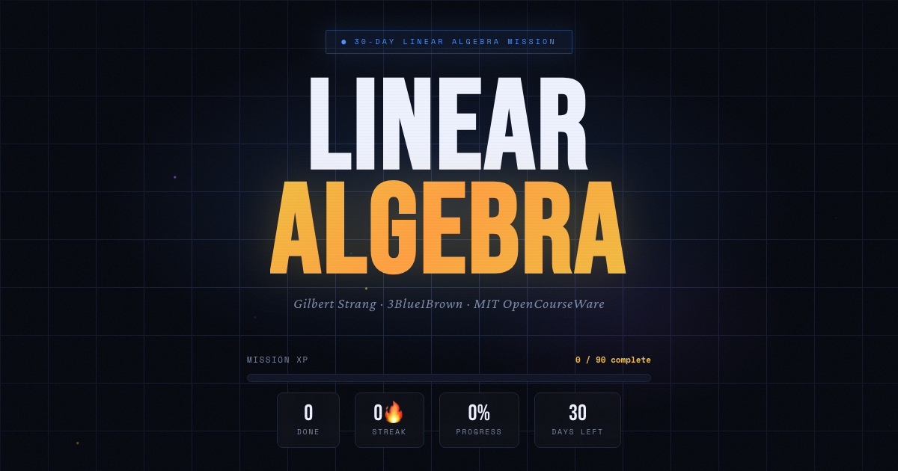
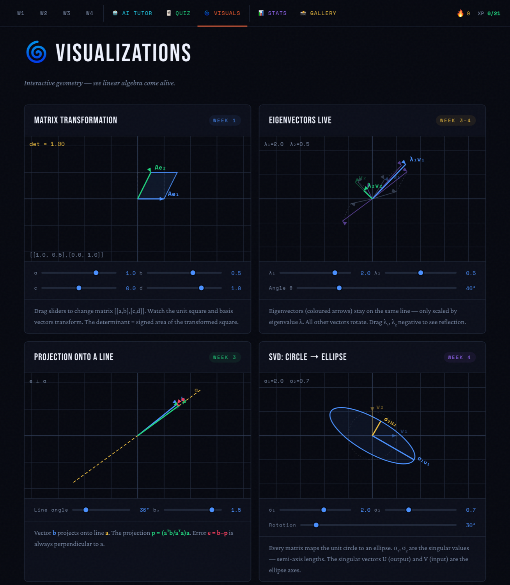

# Linear Algebra · Mission Control

**[Open the live site →](https://whynot-luo.github.io/linear-algebra-mission-control/)**

A 30-day linear algebra study tracker built around Gilbert Strang's **MIT 18.06** and 3Blue1Brown's **Essence of Linear Algebra**. It turns the course into a daily plan with progress tracking, flashcards, quizzes and interactive geometry visualizations, and runs entirely in the browser with no build step and no backend.



Four interactive canvas demos, each driven by live sliders:



## Features

- **30-day plan.** Four weeks of daily sessions. Each day pairs a 3Blue1Brown video (geometry first), an MIT 18.06 lecture with the matching problem set and solutions, and a harder challenge problem.
  Section numbers such as §2.6 refer to Gilbert Strang's *Introduction to Linear Algebra*, 5th edition.
- **Progress tracking.** Per-task checkboxes, XP bar, day-streak counter, a 30-day calendar and per-week progress bars.
- **Notes and sketches.** Notes autosave per day. Photos of hand-drawn sketches are downscaled in the browser and shown in a gallery.
- **Flashcards and quiz.** Flip cards and multiple choice across all four weeks, with week filters, a real shuffle and a running score.
- **Interactive visualizations.** Canvas demos with live sliders: matrix transformation of the unit square, eigenvectors, projection onto a line, and SVD (unit circle to ellipse).
- **AI tutor (optional).** A chat panel that calls the Anthropic API from the browser using the visitor's own key (see below).

## Run it

It is a static site. Any static file server works:

```bash
python3 -m http.server 8000
```

Then open <http://localhost:8000>. Opening `index.html` directly from disk also renders the tracker, quiz and visualizations; the AI tutor is only tested over `http(s)`.

## Deploy to GitHub Pages

1. Push this folder to a GitHub repository.
2. In **Settings → Pages**, set the source to *Deploy from a branch*, branch `main`, folder `/ (root)`.
3. The site is served at `https://<user>.github.io/<repo>/`.

## The AI tutor and your API key

GitHub Pages cannot keep a secret, so the tutor is *bring your own key*:

- The visitor pastes their own Anthropic API key into the tutor tab.
- The key is stored only in that browser's `localStorage` and is sent only to `https://api.anthropic.com`. It is never committed to this repository or sent anywhere else.
- Requests go straight from the browser using Anthropic's opt-in direct-browser-access header. Use a key with a spend limit, and remove it (button on the tutor tab) on shared machines.
- Without a key the rest of the site works normally; the tutor tab simply asks for one.

The model is set by `AI_MODEL` at the top of [`js/tutor.js`](js/tutor.js).

## Project structure

```
index.html            page markup
css/style.css         all styles (design tokens are CSS variables at the top)
js/storage.js         localStorage wrapper with an in-memory fallback
js/curriculum.js      the 30-day plan: days, tasks, resource links, concept summaries
js/quiz-data.js       flashcards and multiple-choice questions
js/app.js             state, week/day rendering, stats, gallery, navigation
js/tutor.js           AI tutor (bring-your-own-key)
js/quiz.js            flashcard and quiz engine
js/visuals.js         canvas visualizations
js/main.js            startup wiring
assets/               favicon and social preview image
```

Plain HTML, CSS and JavaScript: no framework, bundler or dependencies. Scripts are classic `<script defer>` files that share one global scope, loaded in the order listed in `index.html`.

## Notes on data

Everything you do (completed tasks, notes, streak, uploaded photos, API key) lives in your browser's `localStorage` on that device. Nothing is uploaded. Clearing site data resets the tracker. Photos are resized to at most 1280 px and re-encoded as JPEG so they fit within the browser's storage quota; if storage is full or blocked, the app warns instead of failing silently.

## Credits

The curriculum links to material owned by others. This project reproduces none of it beyond short original summaries.

- [MIT OpenCourseWare 18.06SC Linear Algebra](https://ocw.mit.edu/courses/18-06sc-linear-algebra-fall-2011/) by Gilbert Strang (CC BY-NC-SA 4.0), and the [MIT 18.06 Spring 2022 course site](https://web.mit.edu/18.06/www/Spring2022/) for exams and problem sets.
- [Essence of Linear Algebra](https://www.3blue1brown.com/topics/linear-algebra) by Grant Sanderson (3Blue1Brown).

This is an independent study tool and is not affiliated with MIT or 3Blue1Brown.

## License

[MIT](LICENSE) for the code in this repository.
